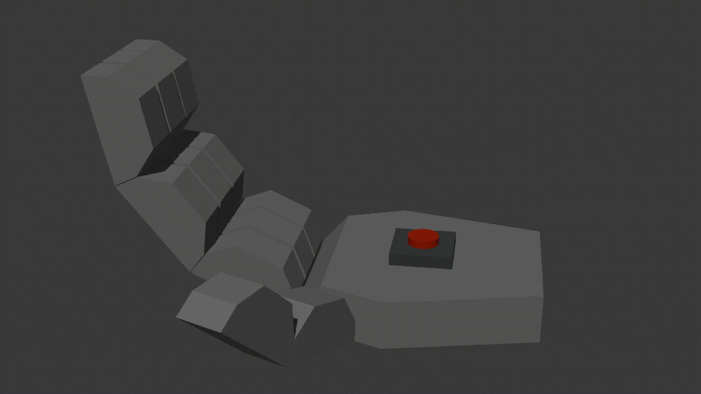

## Пример работы кисти

Ниже показана анимация механической кисти, **смоделированной и анимированной в Blender**.  

*Анимация создана в Blender и экспортирована в формате GIF для демонстрации.*

### Как это работает
1. Сервер `hand.php` принимает GET-запросы.  
2. При `?action=on` вызывается функция `set_hand(true)` — рука сжимается.  
3. При `?action=off` вызывается `set_hand(false)` — рука разжимается.  
4. В реальном устройстве это управляет сервоприводом
5. **В ладони установлена кнопка**. Если в момент сжатия в руке находится предмет, кнопка замыкается, и сервер возвращает дополнительную информацию: `CLOSED (объект в руке)`. Если ладонь пуста — просто `CLOSED`.  
6. Таким образом, сервер не только управляет движением, но и **получает обратную связь** о наличии объекта.
